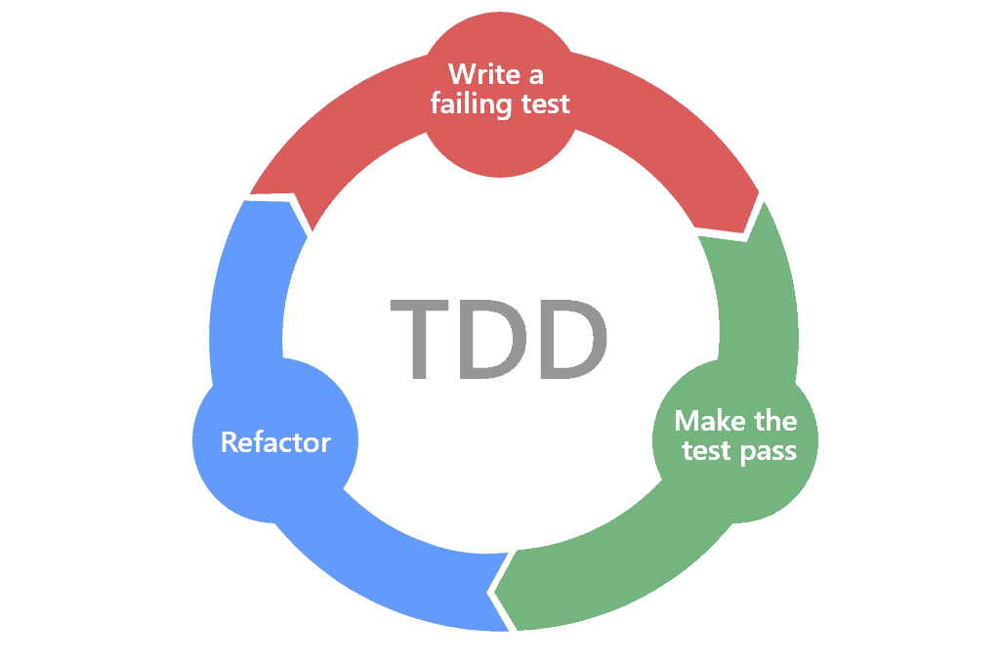

## TDD with Java

### TDD phases

1. Red: write a failing test
2. Green: make the failing test pass
3. Refactor: refactor the existing code. Finally make sure to run step 1 and check is green.
4. Repeat

### Recommended steps

1. Test the simplest thing you can each time
2. Write the simplest test to make the test pass

> Is really important to test all that you can

> You can refactor test code or production code, not both.

> **If you are refactoring production code, leave the test alone**, because that the way you can know the code sill correct.

> **If you are refactoring test code, leave the production code alone**, because you know the production code is green without changes.

> You don't need null checks

